# 树莓派小车

## 硬件环境

* 底盘

    底盘带四个直流电机；

    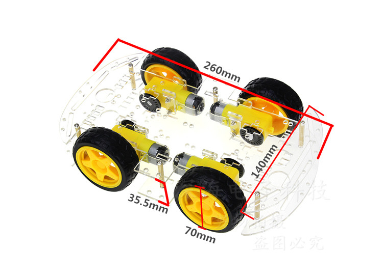

* 电机驱动

    每个L298N可驱动两个电机，共需要两块；

    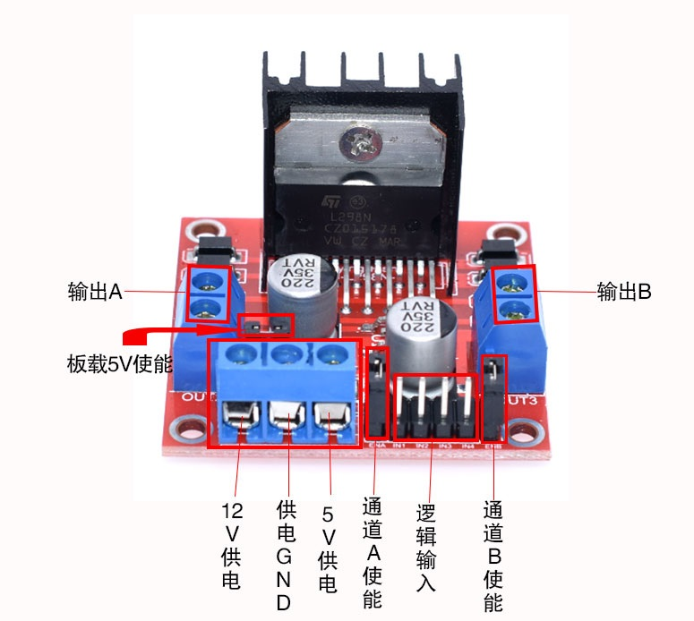

* 码盘计数器

    光电计数器，每个电机一个，共四个；

    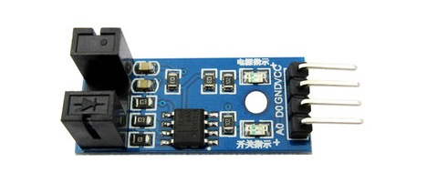

* 直流电机电源

    * 电池

        使用3节18650锂电池串联作为电机的电源，输出电压11.1v（3.7*3）；

        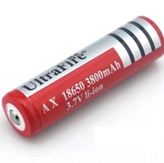

    * 电池盒

        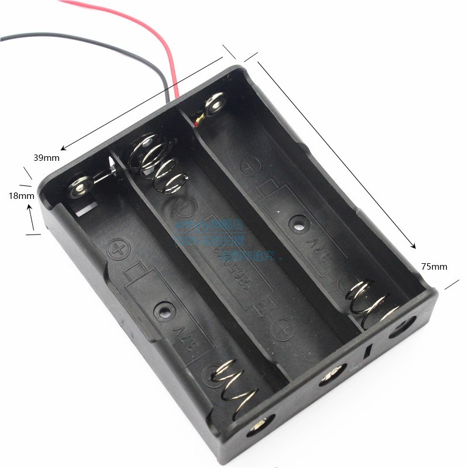

* 控制板

    使用一块STM32板子来控制板电机和各个传感器，通过USB接口与树莓派连接，可灵活控制电机启动时序、保证稳定的控制周期、减少树莓派的IO口使用；

    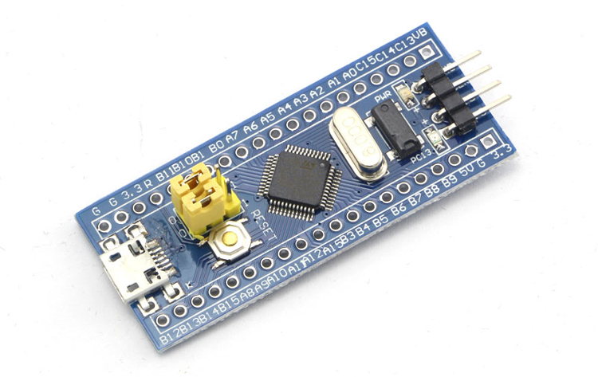

* 树莓派

    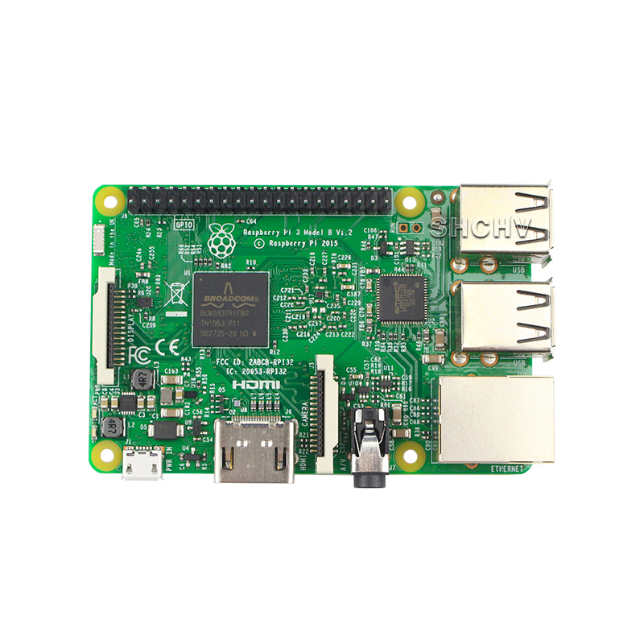

* 树莓派电源

    使用充电宝给树莓派供电；

## 整车效果图

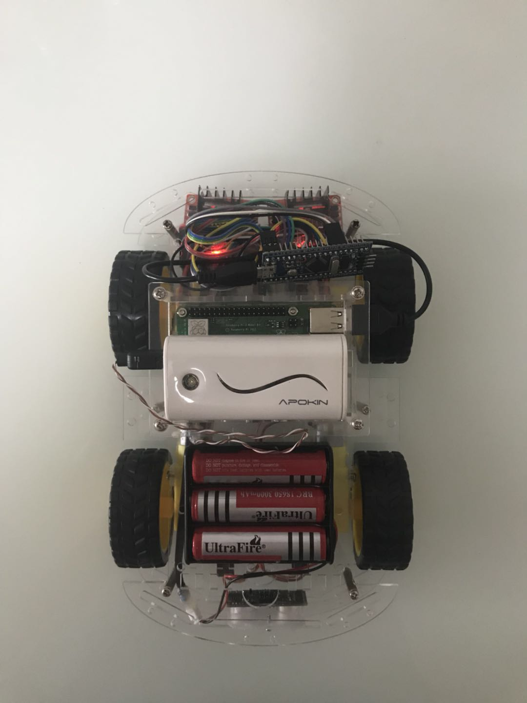

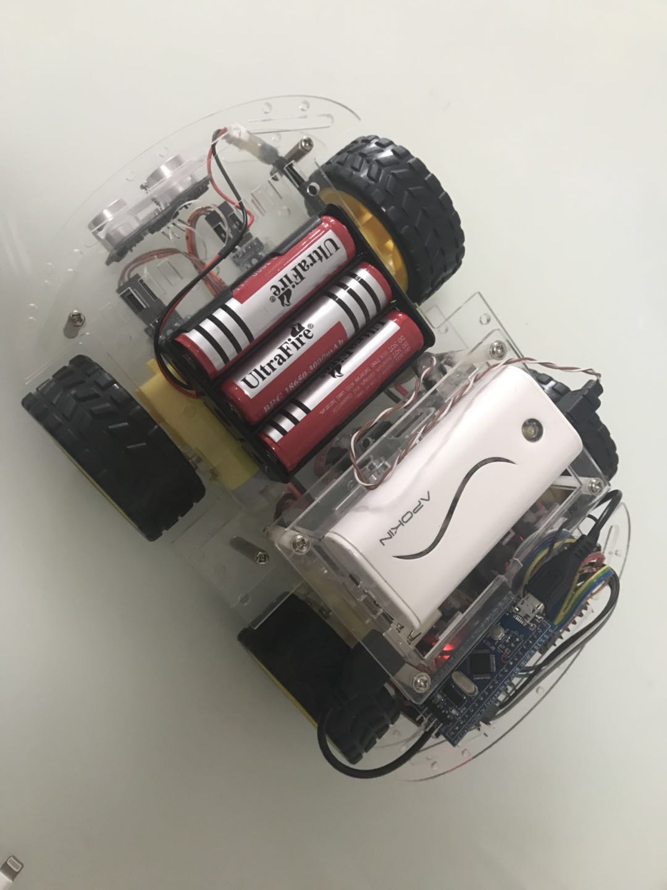

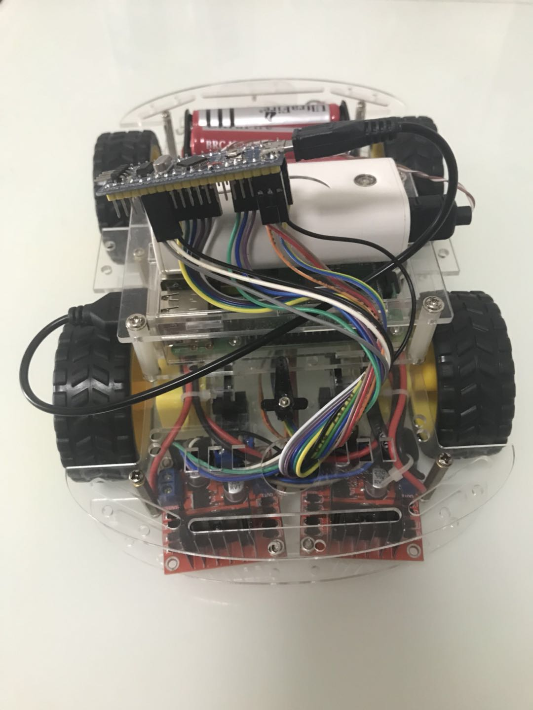

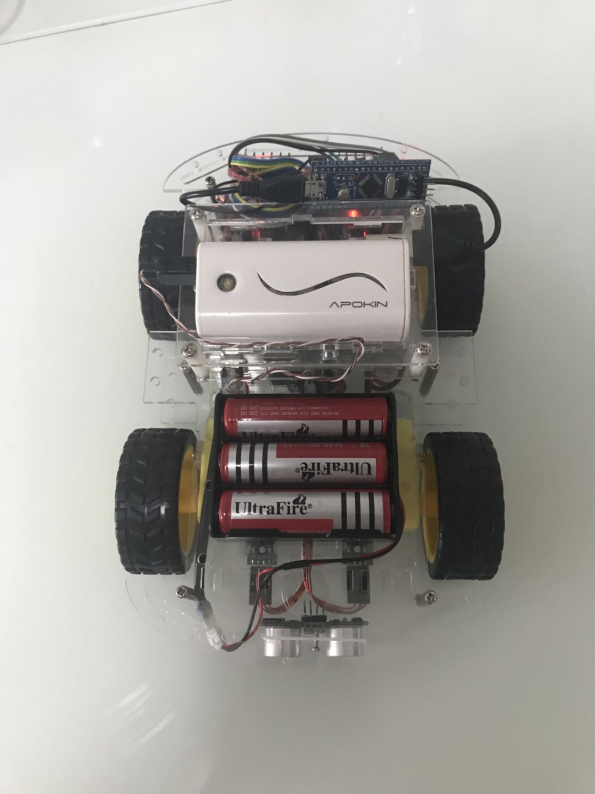
